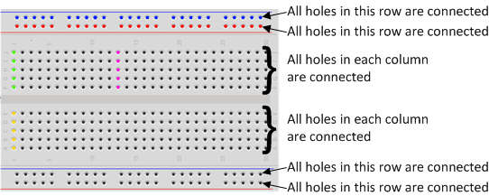

# Girls Who Code Robotics
Girls Who Code robotics session @ BlackRock SF

## Hardware Info
* Kit: Elegoo Arudiono Starter Kit
* Board: Arduino Uno R3
* Communication Port: COM3 (Arduino/Genuino Uno)
* IDE Version: Arduino 1.8.8  

## Before We Start
* Verify the board is properly connected to the Arduino IDE
    * Connect the board to a USB port on your laptop
    * Open the Arduino IDE
    * Go to **Tools -> Board -> Select "Arduino/Genuino Uno"**
    * Go to **Tools -> Port -> Select "COM3 (Arduino/Genuino Uno)"**
    * Go to **Tools -> Get Board Info** and it should print out some basic info of the board
    * Press **Ctrl + Shift + m** to open the serial monitor and make sure **baud rate = 96000**

* Breadboard Basics    

## Exercises
* Basics: Lesson 2,3
* Inputs: Lesson 5, 6
* Sensors: Lesson 10, 11, 
* Remote Control: Lesson 13
* LCD: Lesson 14 (NameTag)
* Effient Layout using Shift Register and Mux: Lesson 16
* Serial Monitor Control: (hand in hand with Lesson #16) Lesson 17
* Step Motor Controlled With Remote: Lesson 23, 24

## Assignments
* Lesson 2
   * Double blink frequency after each 5 blinks
   * Example, first 5 blinks are each 1 second apart, and on the second round, blinks would be 2 seconds apart from each other
* Lesson 3
   * Calculate current value (Ohm's law), power value (Watt's law) and understand why higher resistor value would make LED dimmer
   * modify wiring + program to make LED blink
* Lesson 5
   * Turn LED on and off but use only one button as opposed to two
* Lesson 6
   * make a car horn - press button to honk and press again to stop (hint: assignement #5)
* Lesson 10
   * make the built-in LED blink faster when the ultrasonic sensor detects object (e.g.hands) approaching
* Lesson 11
   * (assignment is combined with lesson #14)
* Lesson 13
   * Wire in 4 LEDs, each corresponding to DOWN, UP, FAST BACK, FAST FORWARD respectively on the remote controller. Pressing a button would result in 1 LED turned on
* Lesson 14
   * Display temperature and humidity values on the LCD
